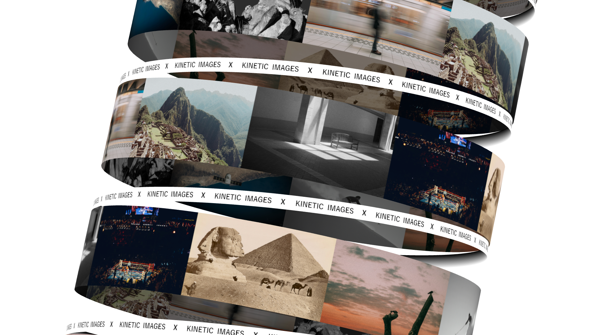

# Three.js Spinning Images



A 3D image carousel with spinning animations.

Live Demo: [three-js-spinning-images.vercel.app](https://three-js-spinning-images.vercel.app)

## Technologies Used

- React
- Vite
- Three.js / React Three Fiber
- Drei

## Installation

1. Clone the repository:

```bash
git clone https://github.com/SebastianKullander9/three-js-spinning-images.git
cd three-js-spinning-images
```

2. Install dependencies:

```bash
npm install
```

3. Start the development server:

```bash
npm run dev
```
